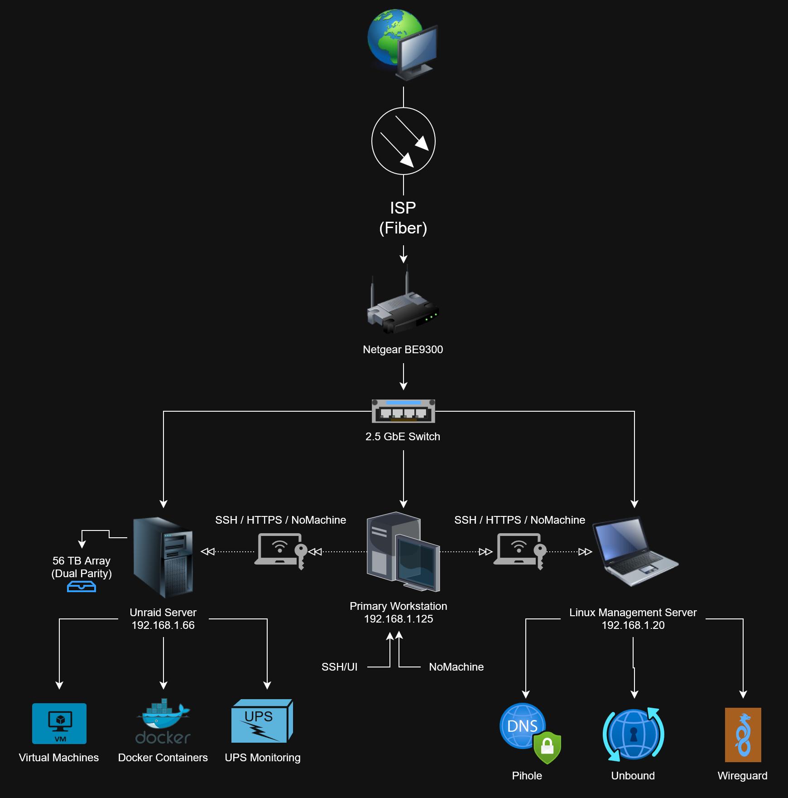

# Network Architecture

This document describes the physical and logical network architecture of my homelab, including infrastructure, management systems, networking decisions, and remote access strategy.

---

# Design Goals

This network was built with the following objectives:

- Reliable self-hosted services
- Secure remote administration
- High-speed local file transfers
- Simple management
- Practical systems administration experience
- Minimal public attack surface
- Easy disaster recovery

---

# Physical Architecture

---

# Core Infrastructure

| Device | Purpose |
|----------|----------|
| Netgear BE9300 | Primary router |
| 2.5 GbE Switch | High-speed LAN connectivity |
| Unraid Server | Primary virtualization and storage platform |
| Linux Mint Server | Network services, DNS, VPN, remote management |
| Gaming Desktop | Primary workstation |
| Steam Deck | Remote game streaming client |

---

# IP Addressing

Static IPs are assigned to all infrastructure devices to simplify management and ensure services remain accessible after reboots.

| Device | Address |
|----------|----------|
| Router | 192.168.1.254 |
| Linux Mint | 192.168.1.20 |
| Unraid | 192.168.1.66 |
| Gaming Desktop | 192.168.1.125 |

---

# Networking Services

## Pi-hole

Purpose

- Network-wide DNS filtering
- Centralized DNS management
- Local DNS resolution

Why

Provides centralized DNS administration while reducing unwanted advertising and telemetry across the network.

---

## Unbound

Purpose

Recursive DNS resolver.

Why

Removes dependency on third-party upstream DNS providers and improves privacy.

---

## WireGuard

Purpose

Secure VPN access to the home network.

Why

Allows encrypted remote administration without exposing management interfaces directly to the Internet.

Primary uses:

- SSH
- NoMachine
- Unraid
- Internal web interfaces

---

## Cloudflare Tunnel

Purpose

Securely publish selected services without opening inbound firewall ports.

Why

Cloudflare Tunnel allows remote access while significantly reducing the public attack surface compared to traditional port forwarding.

---

# Application Services

Applications are deployed as Docker containers and grouped by their role within the environment.

Primary Docker services currently include:

| Service | Purpose |
|----------|----------|
| Plex | Media streaming |
| Audiobookshelf | Audiobook server |
| Nextcloud | Personal cloud storage |
| Vaultwarden | Password management |
| Immich | Photo backup |
| Grafana | Infrastructure monitoring |
| Nginx Proxy Manager | Reverse proxy |
| PostgreSQL | Database services |
| MariaDB | Database services |
| Matrix Synapse | Messaging |

---

# Infrastructure Layout

The homelab intentionally separates infrastructure services from application hosting.

## Unraid Server

Responsible for:

- Docker containers
- Virtual machines
- Primary storage
- Media services
- Backups

Keeping application workloads isolated simplifies upgrades while taking advantage of Unraid's storage management.

---

## Linux Mint Server

Responsible for:

- Pi-hole
- Unbound
- WireGuard
- DNS
- Remote administration

Separating core networking services from the primary server ensures DNS and VPN remain available even if Docker maintenance or server reboots are required.

---

# Storage

Current storage platform:

- ~56 TB protected storage
- Dual parity
- 2 TB NVMe cache
- SMB shares
- Docker appdata
- Daily backups
- SMART monitoring
- UPS battery backup

---

# Remote Administration

Infrastructure is administered almost entirely remotely. Administrative access is performed over encrypted channels, eliminating the need for direct physical access except during hardware maintenance.

- SSH
- NoMachine
- WireGuard VPN
- Unraid Web UI
- Cloudflare Tunnel (selected services only)

Management interfaces are not exposed directly to the Internet.

---

# Monitoring

Infrastructure health is monitored using:

- Grafana
- Plex Dash
- SMART monitoring
- UPS monitoring
- Docker status
- System resource utilization

---

# Security Design

The homelab follows a "minimum exposure" philosophy.

Current controls include:

- WireGuard for administrative access
- Cloudflare Tunnel for externally accessible services
- No inbound management ports exposed publicly
- Static infrastructure addressing
- DNS filtering through Pi-hole
- Password management with Vaultwarden
- Regular Docker image updates
- UPS protection and graceful shutdown capability

Future improvements:

- VLAN segmentation
- Windows Active Directory lab
- Centralized authentication
- Infrastructure as Code
- Enhanced monitoring

---

# Current Scale

- ~56 TB protected storage
- 30+ Docker containers
- Supports approximately 23 active users
- Multiple self-hosted services
- 2.5 GbE LAN
- Secure remote administration
- Daily operational use

---

# Availability & Reliability

Measures taken to improve reliability include:

- Dual parity storage
- APC UPS battery backup
- SMART monitoring
- Docker restart policies
- Static IP addressing
- Daily backups
- Documented recovery procedures
- Infrastructure troubleshooting log

---

# Design Decisions

Several architectural decisions were made to prioritize reliability, security, and maintainability.

- Infrastructure services (DNS/VPN) run independently from application hosting.
- Administrative access is performed over WireGuard instead of exposing management ports.
- Cloudflare Tunnel is used for selected public-facing services to reduce attack surface.
- Static IP addresses simplify administration and service discovery.
- Core infrastructure changes and outages are documented to improve future troubleshooting.

---

# Troubleshooting

All production issues encountered in this environment are documented in:

[Troubleshooting Log](Troubleshooting.md)

Entries include:

- Symptoms
- Diagnosis process
- Root cause
- Resolution
- Prevention

---

# Design Philosophy

This network is designed to provide practical systems administration experience through daily operation and maintenance.

Rather than building isolated demonstrations, services are deployed for real-world use. Problems are documented, root causes investigated, and recovery procedures recorded to continuously improve both the infrastructure and my understanding of Linux, networking, and systems administration.

---

---

## Additional Documentation

- [Repository Overview](../README.md)
- [Troubleshooting Log](Troubleshooting.md)
